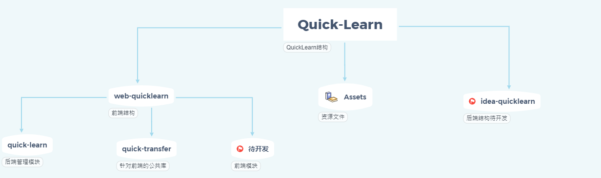

# Blog-QuickLearn
基于SpringBoot + Angular8 + NG-ZORRO的前后端分离博客系统（后端暂未开发..）

### Quick-Learn目录结构图

------

### 版本管理

|    名称     |   版本   |
| :---------: | :------: |
|   Node.js   | v12.16.1 |
|     npm     | v6.14.6  |
| Angular Cli | v8.3.26  |
| Typescript  |  v3.5.3  |

------

### 基本环境搭建

1. 基于 vscode 开发工具

   下载地址：https://code.visualstudio.com/

2. node.js 稳定版

   下载地址：http://nodejs.cn/download/

3. npm 包管理

4. 安装 Angular Cli 脚手架

   Angular文档中心：https://angular.cn/docs

5. NG-ZORRO组件库

   文档地址：https://ng.ant.design/version/8.5.x/docs/introduce/zh